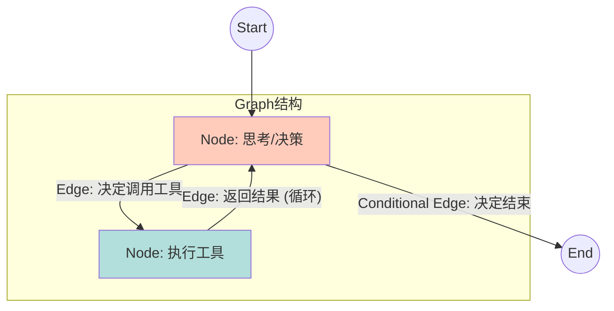

# di-brain LangChain 架构详解

本文档详细分析 di-brain 项目中 LangChain 的图（Graph）、链（Chain）、节点（Node）和边（Edge）的架构设计。

---

## 目录

1. [LangChain 核心概念](#1-langchain-核心概念)
2. [整体架构概览](#2-整体架构概览)
3. [主链路：Common Agent Graph](#3-主链路common-agent-graph)
4. [Text2SQL 图族](#4-text2sql-图族)
5. [Ask Data 图族](#5-ask-data-图族)
6. [Fix SQL 图](#6-fix-sql-图)
7. [Data Scope Clarification 图](#7-data-scope-clarification-图)
8. [链（Chain）设计](#8-链chain设计)
9. [节点详解](#9-节点详解)
10. [工作流程示例](#10-工作流程示例)

---

## 1. LangChain 核心概念

### 1.1 基础概念

| 概念 | 定义 | 用途 |
|------|------|------|
| **StateGraph** | 有状态的有向图 | 构建整个工作流程的骨架 |
| **Node** | 节点（处理函数） | 执行具体的业务逻辑 |
| **Edge** | 边（连接） | 定义节点之间的流转关系 |
| **Conditional Edge** | 条件边 | 根据状态条件动态路由 |
| **Chain** | 链（Runnable 组合） | 组合多个处理步骤成为管道 |
| **State** | 状态对象 | 携带整个工作流的数据 |




### 1.2 LangGraph 处理模式

```
START
  │
  ├─→ Node 1 ─→ Node 2 ─→ Node 3
  │                │        │
  │          (条件边)    (条件边)
  │                │        │
  │            支路1      支路2
  │                │        │
  │            Node 4    Node 5
  │                │        │
  └─────────────→ Node 6 ─→ END
```

di-brain 采用的设计模式：

- **线性流程**：预处理 → 核心逻辑 → 后处理 → 输出
- **条件分支**：根据状态决定下一步（是否继续、是否有错误等）
- **并行执行**：多个节点同时运行后汇聚（SQL 生成的两条策略）
- **迭代检索**：如果需要更多信息，循环回到检索步骤

---

## 2. 整体架构概览

### 2.1 全景图

```
┌─────────────────────────────────────────────────────────────────────────────────┐
│                         DI-BRAIN 全景架构                                        │
├─────────────────────────────────────────────────────────────────────────────────┤
│                                                                                  │
│                           用户输入 (ChatRequest)                                 │
│                                    │                                             │
│                                    ▼                                             │
│                        ┌──────────────────────┐                                  │
│                        │  Common Agent Graph  │  ★ 主路由图                     │
│                        │  (tool_router.py)   │                                  │
│                        └──────────┬───────────┘                                  │
│                                   │                                             │
│        ┌──────────────┬───────────┼───────────┬──────────────┐                 │
│        ▼              ▼           ▼           ▼              ▼                 │
│    ┌────────┐   ┌────────┐  ┌────────┐  ┌────────┐   ┌────────┐              │
│    │Find    │   │Text    │  │Chat    │  │Data    │   │Other   │              │
│    │Data    │   │2SQL    │  │BI      │  │Scope   │   │Tools   │              │
│    │Graph   │   │Graph   │  │Chain   │  │Graph   │   │        │              │
│    └────────┘   └────────┘  └────────┘  └────────┘   └────────┘              │
│         │            │           │          │           │                    │
│         └────────────┴───────────┴──────────┴───────────┘                    │
│                             │                                                 │
│                             ▼                                                 │
│                     ┌──────────────────┐                                      │
│                     │  Response Format │                                      │
│                     │  & Return        │                                      │
│                     └──────────────────┘                                      │
│                                                                                  │
└─────────────────────────────────────────────────────────────────────────────────┘
```

### 2.2 核心文件结构

```
di_brain/
├── router/
│   ├── tool_router.py                    ★ Common Agent Graph (主路由)
│   ├── common_agent_state.py             # 主状态定义
│   ├── common_agent_prompt.py            # 主 Prompt
│   └── common_agent_tools.py             # 工具定义
│
├── text2sql/
│   ├── text2sql_graph.py                 # 协调器
│   ├── text2sql_ask_human_graph.py       # Ask Human 图
│   ├── text2sql_ask_human_compass_graph.py  # Compass 版本
│   ├── text2sql_basic_graph.py           # 基础版本
│   ├── text2sql_basic_compass_graph.py   # Compass 基础版本
│   ├── text2sql_step.py                  # 节点函数定义
│   └── state.py                          # Text2SQL 状态
│
├── ask_data/
│   ├── graph.py                          ★ Ask Data 图
│   ├── state.py                          # Ask Data 状态
│   ├── kb_context_composer.py            # KB 组装
│   └── configuration.py                  # 配置
│
├── ask_data_global/
│   └── graph.py                          # Ask Data Global 图 (多KB并行)
│
├── chat_bi/
│   ├── chat_bi_chain.py                  # ChatBI 链
│   └── chat_bi_stream_runnable.py        # ChatBI 流式运行
│
├── fix_sql/
│   ├── fix_sql_graph.py                  # Fix SQL 图
│   ├── fix_sql_json_based_prompt_graph.py
│   ├── fix_sql_md_based_prompt_graph.py
│   └── fix_sql_html_based_prompt_graph.py
│
├── data_scope_agent/
│   └── data_scope_clarification_agent.py # Data Scope 图
│
└── chain.py                              # 各种链定义
```

---

## 3. 主链路：Common Agent Graph

### 3.1 图结构

**文件位置**：`di_brain/router/tool_router.py`

Common Agent Graph 是整个系统的路由中枢，负责：

1. 理解用户意图
2. 路由到合适的子图或工具
3. 返回最终结果

### 3.2 节点定义

```
┌─────────────────────────────────────────────────────────────────────────────────┐
│                    Common Agent Graph 节点                                       │
├─────────────────────────────────────────────────────────────────────────────────┤
│                                                                                  │
│  START                                                                           │
│   │                                                                              │
│   ▼                                                                              │
│  ┌──────────────────────────────────────────────────────────────────────┐      │
│  │ 1. invoked_common_agent_node                                         │      │
│  │    - 用户输入 → Common Agent (LLM)                                   │      │
│  │    - 输出：Agent 理解的用户意图和参数                                │      │
│  │    - 返回类型：AgentAction 或 AgentFinish                            │      │
│  └──────────────────────┬───────────────────────────────────────────────┘      │
│                         │                                                        │
│                  (条件分支)                                                      │
│                         │                                                        │
│         ┌───────────────┼───────────────┐                                       │
│         ▼               ▼               ▼                                       │
│     ┌────────┐    ┌────────┐      ┌─────────────┐                             │
│     │Handle  │    │Handle  │      │Handle End   │                             │
│     │Tool    │    │Tool    │      │(No Tools)   │                             │
│     │Calls   │    │Error   │      │             │                             │
│     └───┬────┘    └───┬────┘      └──────┬──────┘                             │
│         │             │                   │                                     │
│   (执行工具)    (重试或放弃)         (格式结果)                                  │
│         │             │                   │                                     │
│         └─────────────┴───────────────────┘                                    │
│                        │                                                        │
│                        ▼                                                        │
│  ┌──────────────────────────────────────────────────────────────────────┐      │
│  │ 2. loop_node (可选)                                                  │      │
│  │    - 处理需要多步骤的工具调用                                        │      │
│  │    - 循环调用 agent 和工具直到完成                                   │      │
│  └──────────────────────┬───────────────────────────────────────────────┘      │
│                         │                                                        │
│                        END                                                       │
│                                                                                  │
└─────────────────────────────────────────────────────────────────────────────────┘
```

### 3.3 核心代码：主路由函数

```python
# di_brain/router/tool_router.py (第 1600+ 行)
def invoked_common_agent_node(
    state: CommonAgentState, 
    config: RunnableConfig
) -> Command:
    """
    主 Agent 节点：
    1. 调用 LLM 理解用户意图
    2. 生成工具调用或最终回答
    3. 根据结果路由到不同分支
    """
    
    # 1. 准备消息
    messages = state.get("messages", [])
    
    # 2. 调用 Agent LLM
    structured_llm = GET_STRUCTURED_LLM("gpt-4.1-mini")
    agent_response = structured_llm.invoke(
        messages,
        tools=[tool1, tool2, ...],  # 定义的所有工具
    )
    
    # 3. 根据响应类型路由
    if isinstance(agent_response, AgentFinish):
        # 最终回答
        return Command(
            goto=END,
            update={"messages": [...agent_response]}
        )
    elif isinstance(agent_response, AgentAction):
        # 需要调用工具
        return Command(
            goto="handle_tool_calls",
            update={"pending_actions": [agent_response]}
        )
```

### 3.4 工具定义

Common Agent 可调用的工具包括：

```python
@tool
def find_data_docs(...):
    """发现相关的数据表、文档、术语和规则"""
    # 调用 ask_data_global_graph
    
@tool
def generate_sql_and_execute(...):
    """生成并执行 SQL 查询"""
    # 调用 text2sql_graph
    
@tool
def ask_chat_bi(...):
    """智能数据分析和图表生成"""
    # 调用 chat_bi_chain
    
@tool
def clarify_data_scope(...):
    """澄清数据域范围"""
    # 调用 data_scope_clarification_graph
```

---

## 4. Text2SQL 图族

### 4.1 概述

Text2SQL 是将自然语言转换为 SQL 查询的核心模块。项目中有多个版本：

| 图名 | 用途 | 适用场景 |
|------|------|---------|
| **text2sql_basic_graph** | 基础版本 | 简单查询，不涉及人工干预 |
| **text2sql_ask_human_graph** | Ask Human 版本 | 需要确认占位符或其他信息的情况 |
| **text2sql_basic_compass_graph** | Compass 优化版 | 使用 Compass 模型的基础版 |
| **text2sql_ask_human_compass_graph** | Compass + Ask Human | 完整功能版本 |
| **text2sql_graph** | 协调器 | 选择合适的版本并执行 |

### 4.2 Ask Human 版本详解

**文件位置**：`di_brain/text2sql/text2sql_ask_human_graph.py`

#### 4.2.1 完整流程图

```
┌──────────────────────────────────────────────────────────────────────────────┐
│                   Text2SQL Ask Human Graph 完整流程                            │
├──────────────────────────────────────────────────────────────────────────────┤
│                                                                                │
│  START                                                                         │
│   │                                                                            │
│   ▼                                                                            │
│  ┌───────────────────────────────────────────────────────────────────┐       │
│  │ 1. preprocess_and_analyze_context (预处理和分析上下文)               │       │
│  │    ├─ 检查是否有已选择的表                                        │       │
│  │    ├─ 从 KB 中检索表详情、样例 SQL、样例数据                     │       │
│  │    ├─ 判断上下文是否足够生成 SQL                                 │       │
│  │    └─ 输出：context, sample_sql, sample_data, should_continue    │       │
│  └──────────────┬──────────────────────────────────────────────────┘       │
│                 │                                                            │
│            (条件分支)  should_continue_or_end                               │
│                 │                                                            │
│         ┌───────┴────────┐                                                  │
│         ▼                ▼                                                  │
│      "end"           "continue"                                             │
│         │                │                                                  │
│         │            ┌────────────────────────────────────────────┐        │
│         │            │ 2. continue_generate_sql (触发 SQL 生成)   │        │
│         │            │    - 准备两条并行的 SQL 生成策略           │        │
│         │            └────┬───────────────────┬──────────────────┘        │
│         │                 │                   │                            │
│         │    (并行执行双策略)                                              │
│         │                 │                   │                            │
│         │       ┌─────────┼─────────┐        │                            │
│         │       ▼                   ▼        │                            │
│         │    ┌──────────────┐  ┌──────────────────┐                      │
│         │    │ 3a. Plan &   │  │ 3b. Divide &     │                      │
│         │    │ Reflect      │  │ Conquer          │                      │
│         │    │ (Compass)    │  │ (Compass)        │                      │
│         │    └──────┬───────┘  └────────┬─────────┘                      │
│         │           │                   │                                 │
│         │           │  (汇聚)            │                                 │
│         │           └─────────┬─────────┘                                 │
│         │                     │                                            │
│         │       ┌─────────────────────────────────────────┐              │
│         │       │ 4. choose_better_sql_and_analyze_       │              │
│         │       │     placeholder                         │              │
│         │       │                                         │              │
│         │       │ - 比较两条 SQL 的质量                 │              │
│         │       │ - 检查是否含有占位符 [PLACEHOLDER]    │              │
│         │       │ - 决定是否需要继续处理                │              │
│         │       └────────────┬────────────────────────────┘              │
│         │                    │                                            │
│         │               (条件分支)                                         │
│         │                    │                                            │
│         │            ┌───────┴────────┐                                  │
│         │            ▼                ▼                                  │
│         │         "end"          "continue"                              │
│         │            │                │                                  │
│         │            │     ┌──────────────────────────────┐             │
│         │            │     │ 5. fix_and_validate_sql      │             │
│         │            │     │                              │             │
│         │            │     │ - 处理占位符                │             │
│         │            │     │ - 验证 SQL 语法             │             │
│         │            │     │ - 执行测试（可选）          │             │
│         │            │     └──────────┬───────────────────┘             │
│         │            │                │                                  │
│         │            └────────┬───────┘                                  │
│         │                     │                                          │
│         │       ┌─────────────────────────────────────────┐            │
│         │       │ 6. generate_output                      │            │
│         │       │                                         │            │
│         │       │ - 格式化输出                           │            │
│         │       │ - 返回最终 SQL 和相关元数据            │            │
│         │       └────────────┬────────────────────────────┘            │
│         │                    │                                          │
│         └────────┬───────────┘                                          │
│                  │                                                       │
│                  ▼                                                       │
│                 END                                                      │
│                                                                          │
└──────────────────────────────────────────────────────────────────────────────┘
```

#### 4.2.2 节点详解

```python
# 节点 1: preprocess_and_analyze_context
def preprocess_and_analyze_context(state, config):
    """
    预处理和分析上下文
    
    处理步骤：
    1. 解析用户输入和chat历史
    2. 确定使用哪种模型（Compass 或 Gemini）
    3. 调用 find_data 检索相关表
    4. 从 KB 获取表详情、样例 SQL、样例数据
    5. 组装提示词
    6. 判断上下文是否足够
    
    返回：
    - context: 完整的上下文字符串
    - sample_sql: 示例 SQL
    - sample_data: 示例数据
    - should_continue: 是否需要人工确认
    """
    pass

# 节点 3a/3b: generate_sql_plan_and_reflect & generate_sql_divide_and_conquer
def generate_sql_plan_and_reflect(state, config):
    """
    Plan & Reflect 策略（两个并行策略之一）
    
    步骤：
    1. LLM 生成详细计划（表选择、Join、WHERE 条件等）
    2. LLM 基于计划生成 SQL
    3. LLM 反思生成的 SQL 的正确性
    """
    pass

def generate_sql_divide_and_conquer(state, config):
    """
    Divide & Conquer 策略（两个并行策略之一）
    
    步骤：
    1. LLM 将复杂问题分解为子问题
    2. 逐个解答子问题生成 Partial SQL
    3. LLM 组装最终 SQL
    """
    pass

# 节点 4: choose_better_sql_and_analyze_placeholder
def choose_better_sql_and_analyze_placeholder(state, config):
    """
    选择更好的 SQL 并分析占位符
    
    处理：
    1. 比较两条 SQL 的质量（通过 LLM 评分）
    2. 选择更好的那条
    3. 检查是否包含 [PLACEHOLDER] 标记
    4. 决定是否需要用户确认占位符的具体值
    """
    pass

# 节点 5: fix_and_validate_sql
def fix_and_validate_sql(state, config):
    """
    修复和验证 SQL
    
    处理：
    1. 如果有占位符，调用 fix_sql 子图处理
    2. 验证 SQL 语法正确性
    3. （可选）执行查询测试
    """
    pass
```

### 4.3 两种生成策略的工作原理

#### 4.3.1 Plan & Reflect

```
用户问题：
"查询每个区域最近 7 天的销售总额"

Step 1: Planner Prompt
━━━━━━━━━━━━━━━━━━━━━━━━━━━━━━━
Given the user query, create a detailed plan:
- Which tables to select?
- What JOIN conditions?
- What WHERE conditions?
- GROUP BY?
- ORDER BY?

Answer:
  表选择: order_fact (订单), region_dim (区域)
  JOIN 条件: order_fact.region_id = region_dim.id
  WHERE: grass_date >= current_date - 7
  GROUP BY: region
  聚合: SUM(gmv)

Step 2: SQL Generation Prompt
━━━━━━━━━━━━━━━━━━━━━━━━━━━━━━━
Based on the plan, generate SQL:
  SELECT 
    region_dim.region_name,
    SUM(order_fact.gmv) as total_gmv
  FROM order_fact
  JOIN region_dim ON order_fact.region_id = region_dim.id
  WHERE order_fact.grass_date >= current_date - interval '7' day
  GROUP BY region_dim.region_name
  ORDER BY total_gmv DESC

Step 3: Reflect
━━━━━━━━━━━━━━━━━━━━━━━━━━━━━━━
Reflect on the SQL:
- 是否正确处理了分区列？✓
- 是否正确处理了日期范围？✓
- 是否包含了必要的 JOIN？✓
```

#### 4.3.2 Divide & Conquer

```
用户问题：
"查询每个区域最近 7 天的销售总额"

Step 1: Divide
━━━━━━━━━━━━━━━━━━━━━━━━━━━━━━━
分解为子问题：
  子问题 1: 哪个表存储订单数据？
    答案: order_fact
  
  子问题 2: 哪个表存储区域信息？
    答案: region_dim
  
  子问题 3: 如何定义"最近 7 天"？
    答案: grass_date >= current_date - interval '7' day

Step 2: Conquer (生成 Partial SQL)
━━━━━━━━━━━━━━━━━━━━━━━━━━━━━━━
Sub-SQL 1 (订单数据):
  SELECT *, region_id 
  FROM order_fact
  WHERE grass_date >= current_date - interval '7' day

Sub-SQL 2 (区域信息):
  SELECT * FROM region_dim

Sub-SQL 3 (聚合):
  SELECT region_id, SUM(gmv) FROM ...
  GROUP BY region_id

Step 3: Assemble
━━━━━━━━━━━━━━━━━━━━━━━━━━━━━━━
组装最终 SQL:
  SELECT 
    rd.region_name,
    SUM(of.gmv) as total_gmv
  FROM (
    SELECT *, region_id FROM order_fact
    WHERE grass_date >= current_date - interval '7' day
  ) of
  JOIN region_dim rd ON of.region_id = rd.id
  GROUP BY rd.region_name
```

### 4.4 条件边（Conditional Edge）

```python
# 条件 1: should_continue_or_end (第一次)
def should_continue_or_end(state):
    """
    判断是否有足够的上下文继续 SQL 生成
    
    返回值：
    - "end"：上下文不足，输出错误或提示
    - "continue"：上下文足够，继续 SQL 生成
    """
    context_sufficient = state.get("context_sufficient", False)
    if context_sufficient:
        return "continue"
    else:
        return "end"

# 条件 2: should_continue_or_end (第二次)
def should_continue_or_end(state):
    """
    判断是否需要处理占位符
    
    返回值：
    - "end"：SQL 完整，输出结果
    - "continue"：有占位符，继续处理
    """
    has_placeholder = "[PLACEHOLDER]" in state.get("sql", "")
    if has_placeholder:
        return "continue"  # 调用 fix_and_validate_sql
    else:
        return "end"  # 直接输出
```

---

## 5. Ask Data 图族

### 5.1 Ask Data 图概述

**文件位置**：`di_brain/ask_data/graph.py`

Ask Data 图负责从知识库中检索信息并回答数据相关问题。

### 5.2 Ask Data 图节点

```
┌──────────────────────────────────────────────────────────────────────────────┐
│                       Ask Data Graph 节点                                     │
├──────────────────────────────────────────────────────────────────────────────┤
│                                                                                │
│  START                                                                         │
│   │                                                                            │
│   ▼                                                                            │
│  ┌────────────────────────────────────────────────────────────────────┐      │
│  │ 1. retrieve_knowledge_base_as_context                              │      │
│  │    - 调用 compose_kb_context 从 MySQL/Milvus/ES 检索              │      │
│  │    - 组装为 SystemMessage + HumanMessage                           │      │
│  │    - 更新 chat_history.msg_list                                    │      │
│  └────────────┬─────────────────────────────────────────────────────┘      │
│               │                                                              │
│               ▼                                                              │
│  ┌────────────────────────────────────────────────────────────────────┐      │
│  │ 2. invoke_msg_with_llm                                              │      │
│  │    - 调用结构化 LLM (GPT-4.1-mini)                                 │      │
│  │    - 输出类型：DirectAnswer, SearchMoreInfoThenAnswer, DontKnow   │      │
│  └────────────┬─────────────────────────────────────────────────────┘      │
│               │                                                              │
│           (条件分支)  llm_res_router                                        │
│               │                                                              │
│    ┌──────────┼──────────┐                                                  │
│    ▼          ▼          ▼                                                  │
│ DirectAnswer | SearchMore| DontKnow                                        │
│    │         | InfoThen  │    │                                            │
│    │         | Answer    │    │                                            │
│    │         │           │    │                                            │
│    │         ▼           │    │                                            │
│    │    ┌──────────────────────┐   │                                       │
│    │    │ 3. search_related_   │   │                                       │
│    │    │     tables           │   │                                       │
│    │    │                      │   │                                       │
│    │    │ - 搜索用户要求的表   │   │                                       │
│    │    │ - 获取表详情         │   │                                       │
│    │    │ - 追加到消息列表     │   │                                       │
│    │    └───────┬──────────────┘   │                                       │
│    │            │                  │                                       │
│    │            ▼                  │                                       │
│    │    再次调用 invoke_msg_with_llm              │                        │
│    │            │                  │                                       │
│    │            ▼                  │                                       │
│    │       llm_res_router          │                                       │
│    │            │                  │                                       │
│    └────────┬───┘                  │                                       │
│             │                      │                                       │
│             └──────────┬───────────┘                                       │
│                        │                                                    │
│                        ▼                                                    │
│  ┌────────────────────────────────────────────────────────────────────┐      │
│  │ 4. generate_final_resp                                              │      │
│  │    - 格式化输出                                                     │      │
│  │    - 返回答案或错误信息                                            │      │
│  └────────────┬─────────────────────────────────────────────────────┘      │
│               │                                                              │
│               ▼                                                              │
│              END                                                             │
│                                                                              │
└──────────────────────────────────────────────────────────────────────────────┘
```

### 5.3 Ask Data Global 图

**文件位置**：`di_brain/ask_data_global/graph.py`

Ask Data Global 支持并行搜索多个 Knowledge Base：

```
┌──────────────────────────────────────────────────────────────────────────────┐
│                  Ask Data Global Graph（多KB并行）                            │
├──────────────────────────────────────────────────────────────────────────────┤
│                                                                                │
│  START                                                                         │
│   │                                                                            │
│   ▼                                                                            │
│  ┌──────────────────────────────────────────────────────────────────┐        │
│  │ 1. parallel_search_markets                                        │        │
│  │    - 并行搜索每个 knowledge_base                                 │        │
│  │    - 每个 KB 调用 search_single_market 或 ask_data_graph        │        │
│  └──────────────────────┬───────────────────────────────────────────┘        │
│                         │                                                     │
│                         ▼                                                     │
│                   (并行执行)                                                  │
│       ┌─────────┬─────────┬─────────┐                                        │
│       ▼         ▼         ▼         ▼                                        │
│      KB1       KB2       KB3       KB4                                       │
│    检索结果    检索结果    检索结果    检索结果                                 │
│       │         │         │         │                                        │
│       └─────────┴─────────┴─────────┘                                        │
│                    │                                                          │
│                    ▼                                                          │
│  ┌──────────────────────────────────────────────────────────────────┐        │
│  │ 2. summary_router                                                 │        │
│  │    - 检查是否有有效结果                                          │        │
│  │    - 如果没有，可能转向备用数据源                                │        │
│  │    - 决定下一步路由                                              │        │
│  └──────────────────────┬───────────────────────────────────────────┘        │
│                         │                                                     │
│            ┌────────────┼────────────┐                                       │
│            ▼            ▼            ▼                                       │
│        有结果      无有效结果    无结果且需                                   │
│                               要备用检索                                      │
│            │            │            │                                       │
│            │            │            └─────┐                                │
│            │            │                  ▼                                │
│            │            │        ┌──────────────┐                           │
│            │            │        │search_       │                           │
│            │            │        │subgraph      │                           │
│            │            │        │(重新搜索)    │                           │
│            │            │        └──────┬───────┘                           │
│            │            │               │                                    │
│            ▼            ▼               ▼                                    │
│     ┌─────────────┐  ┌──────────────┐                                       │
│     │ 3. summarize │  │ dontknow_    │                                       │
│     │             │  │ summarize    │                                       │
│     │ - 汇总所有  │  │              │                                       │
│     │   KB 结果   │  │ - 返回"不知道"│                                       │
│     │ - 调用 LLM  │  │   信息        │                                       │
│     │   进行摘要  │  └──────────────┘                                       │
│     └─────────────┘     │                                                   │
│            │            │                                                    │
│            └──────┬──────┘                                                   │
│                   │                                                          │
│                   ▼                                                          │
│                  END                                                         │
│                                                                              │
└──────────────────────────────────────────────────────────────────────────────┘
```

### 5.4 Ask Data 节点实现

```python
# 节点 1: retrieve_knowledge_base_as_context
def retrieve_knowledge_base_as_context(state, config) -> Command:
    """
    检索知识库上下文
    
    处理流程：
    1. 判断是否有历史 chat history
    2. 调用 compose_kb_context 从多个源检索
    3. 组装 SystemMessage (首次) 或 HumanMessage (续)
    4. 返回到 invoke_msg_with_llm
    """
    
    user_query = state.get("user_query")
    knowledge_base_list = state.get("knowledge_base_list", [])
    
    # 调用核心 RAG 组装函数
    retrieve_context, related_glossaries, related_rules = (
        compose_kb_context(knowledge_base_list, user_query)
    )
    
    # 根据是否有历史决定消息格式
    if state.get("chat_history"):
        # 追加模式
        msg_list = state["chat_history"]["msg_list"]
        msg_list.append(HumanMessage(content=retrieve_context + user_query))
    else:
        # 首次对话
        msg_list = [
            SystemMessage(content=role_prompt + retrieve_context),
            HumanMessage(content=user_query),
        ]
    
    return Command(
        goto="invoke_msg_with_llm",
        update={"chat_history": {"msg_list": msg_list}}
    )

# 节点 2: invoke_msg_with_llm
def invoke_msg_with_llm(state, config) -> Command:
    """
    调用 LLM 获取结构化响应
    
    处理流程：
    1. 获取消息列表
    2. 调用结构化 LLM (会强制输出指定的数据类型)
    3. 返回到 llm_res_router 进行分支
    """
    
    msg_list = state["chat_history"]["msg_list"]
    
    structured_llm = GET_STRUCTURED_LLM("gpt-4.1-mini").with_structured_output(
        schema=StructOutput
    )
    
    response = structured_llm.invoke(msg_list)
    
    return Command(
        goto="llm_res_router",
        update={"now_llm_answer": response}
    )

# 条件函数: llm_res_router
def llm_res_router(state, config) -> Command:
    """
    根据 LLM 响应类型路由
    
    逻辑：
    - DirectAnswer → generate_final_resp (输出答案)
    - SearchMoreInfoThenAnswer → search_related_tables (搜索更多表)
    - DontKnow → generate_final_resp (输出无法回答)
    """
    
    res = state.get("now_llm_answer")
    
    if isinstance(res.data, DirectAnswer):
        return Command(goto="generate_final_resp")
    elif isinstance(res.data, SearchMoreInfoThenAnswer):
        return Command(goto="search_related_tables")
    elif isinstance(res.data, DontKnow):
        return Command(goto="generate_final_resp")
```

---

## 6. Fix SQL 图

### 6.1 Fix SQL 图概述

**文件位置**：`di_brain/fix_sql/fix_sql_graph.py`

Fix SQL 图负责修复有问题的 SQL 查询。

### 6.2 Fix SQL 节点

```
┌──────────────────────────────────────────────────────────────────────────────┐
│                         Fix SQL Graph 节点                                    │
├──────────────────────────────────────────────────────────────────────────────┤
│                                                                                │
│  START (输入：错误的 SQL 和错误信息)                                          │
│   │                                                                            │
│   ▼                                                                            │
│  ┌────────────────────────────────────────────────────────────────────┐      │
│  │ 1. 提取错误信息和 SQL 上下文                                       │      │
│  │    - 解析 SQL 错误消息                                            │      │
│  │    - 提取表结构信息                                              │      │
│  └────────────┬─────────────────────────────────────────────────────┘      │
│               │                                                              │
│               ▼                                                              │
│  ┌────────────────────────────────────────────────────────────────────┐      │
│  │ 2. node_fix_sql                                                     │      │
│  │    - 调用 LLM 修复 SQL                                            │      │
│  │    - 使用 JSON/Markdown/HTML 格式的 Prompt 三种方式              │      │
│  └────────────┬─────────────────────────────────────────────────────┘      │
│               │                                                              │
│               ▼                                                              │
│  ┌────────────────────────────────────────────────────────────────────┐      │
│  │ 3. validate_sql                                                     │      │
│  │    - 验证修复后的 SQL 语法                                        │      │
│  │    - 检查错误是否解决                                            │      │
│  └────────────┬─────────────────────────────────────────────────────┘      │
│               │                                                              │
│           (条件分支)                                                         │
│               │                                                              │
│       ┌───────┴────────┐                                                    │
│       ▼                ▼                                                    │
│    有效SQL        无效SQL                                                   │
│       │                │                                                    │
│       │                ▼                                                    │
│       │       (重试修复或放弃)                                              │
│       │                │                                                    │
│       └────────┬───────┘                                                    │
│                │                                                            │
│                ▼                                                            │
│            返回结果                                                         │
│                │                                                            │
│                ▼                                                            │
│               END                                                           │
│                                                                              │
└──────────────────────────────────────────────────────────────────────────────┘
```

### 6.3 Fix SQL 三种格式

项目提供了三种 Fix SQL 的 Prompt 格式：

#### 6.3.1 JSON 格式

```python
# di_brain/fix_sql/fix_sql_json_based_prompt_graph.py
def build_local_hint_schema_graph():
    """使用 JSON 格式的 Schema 定义"""
    
    # Prompt 中包含：
    # - 错误 SQL (JSON)
    # - 错误信息 (JSON)
    # - 表 Schema (JSON)
    # - 修复建议 (JSON)
```

#### 6.3.2 Markdown 格式

```python
# di_brain/fix_sql/fix_sql_md_based_prompt_graph.py
def build_graph_md():
    """使用 Markdown 格式的 Schema 定义"""
    
    # Prompt 中包含：
    # - 错误 SQL (代码块)
    # - 错误信息 (代码块)
    # - 表结构 (表格格式)
```

#### 6.3.3 HTML 格式

```python
# di_brain/fix_sql/fix_sql_html_based_prompt_graph.py
def build_graph_html():
    """使用 HTML 格式的 Schema 定义"""
```

---

## 7. Data Scope Clarification 图

### 7.1 图概述

**文件位置**：`di_brain/data_scope_agent/data_scope_clarification_agent.py`

用于澄清用户的数据查询范围（属于哪个 DataMart/Topic）。

### 7.2 图结构

```
┌──────────────────────────────────────────────────────────────────────────────┐
│              Data Scope Clarification Graph 节点                              │
├──────────────────────────────────────────────────────────────────────────────┤
│                                                                                │
│  START                                                                         │
│   │                                                                            │
│   ▼                                                                            │
│  ┌──────────────────────────────────────────────────────────────────┐        │
│  │ 1. retrieve_scopes                                               │        │
│  │    - 从 KB 获取所有可用的 DataMart/Topic 列表                    │        │
│  │    - 获取每个 Scope 的描述                                       │        │
│  └──────────────────────┬───────────────────────────────────────────┘        │
│                         │                                                     │
│                         ▼                                                     │
│  ┌──────────────────────────────────────────────────────────────────┐        │
│  │ 2. analyze_query                                                  │        │
│  │    - 调用 LLM 分析用户查询                                        │        │
│  │    - 匹配可能的 Scope                                            │        │
│  │    - 返回 QueryAnalysisOutput                                    │        │
│  └──────────────────────┬───────────────────────────────────────────┘        │
│                         │                                                     │
│                 (条件分支)                                                    │
│                         │                                                     │
│        ┌────────────────┼────────────────┐                                   │
│        ▼                ▼                ▼                                   │
│    信息不足       确认Scope        无匹配                                     │
│        │                │                │                                   │
│        ▼                ▼                ▼                                   │
│   ┌──────────┐   ┌──────────┐   ┌──────────────┐                           │
│   │ask for   │   │confirm   │   │fallback to   │                           │
│   │clarifi-  │   │scope     │   │layer 2       │                           │
│   │cation    │   │          │   │tables        │                           │
│   └────┬─────┘   └────┬─────┘   └──────┬───────┘                           │
│        │              │                │                                    │
│        └──────────────┴────────────────┘                                    │
│                       │                                                      │
│                       ▼                                                      │
│                      END                                                     │
│                                                                              │
└──────────────────────────────────────────────────────────────────────────────┘
```

---

## 8. 链（Chain）设计

### 8.1 基础链

**文件位置**：`di_brain/chain.py`

```python
# 1. SQL Explain Chain - 解释 SQL
def create_sql_explain_chain(llm):
    """
    链路：
    RunnablePassthrough.assign(
        chat_history=serialize_history,
        dialect=extract_sql_dialect,
        table_context=gen_explain_sql_table_context,
    ) | prompt | llm | parser
    """
    
    prompt = gen_sql_explain_prompt_without_context()
    chain = (
        RunnablePassthrough.assign(
            chat_history=RunnableLambda(serialize_history),
            dialect=RunnableLambda(extract_sql_dialect),
            table_context=RunnableLambda(gen_explain_sql_table_context),
        )
        | prompt
        | llm
        | StrOutputParser()
    )
    return chain

# 2. SQL Correct Chain - 修正 SQL
def create_sql_correct_chain(llm):
    """
    链路：
    RunnablePassthrough.assign(
        chat_history=serialize_history,
        dialect=extract_sql_dialect,
        error=extract_sql_error_message,
    ) | prompt | llm | parser
    """
    
    prompt = gen_sql_correct_prompt_without_schema()
    chain = (
        RunnablePassthrough.assign(
            chat_history=RunnableLambda(serialize_history),
            dialect=RunnableLambda(extract_sql_dialect),
            error=RunnableLambda(extract_sql_error_message),
        )
        | prompt
        | llm
        | StrOutputParser()
    )
    return chain

# 3. Translator Chain - 翻译
def create_llm_translator_chain():
    """
    链路：
    translator_prompt | llm | output_parser
    """
    pass
```

### 8.2 检索链

```python
# Retrieval Chain - 文档检索
def create_hive_table_retriever_chain(
    milvus_retriever,
    es_retriever,
    column_retriever,
):
    """
    多路检索链：
    1. Milvus 向量检索
    2. ES BM25 检索
    3. 列级检索
    4. 融合排序
    """
    pass

# Database Meta Retriever Chain - 数据库元数据检索
def create_database_meta_retriever_chain():
    """获取 Hive 表元数据"""
    pass
```

### 8.3 ChatBI 链

**文件位置**：`di_brain/chat_bi/chat_bi_chain.py`

```python
# ChatBI Chain - 智能数据分析
chat_bi_chain = create_chat_bi_chain()

# 实现方式：
def create_chat_bi_chain():
    """
    构建 ChatBI 链：
    - 输入：用户问题、表详情
    - 处理：SQL 生成 → 执行 → 结果分析 → 图表建议
    - 输出：SQL + 数据 + 图表建议
    """
    pass
```

### 8.4 链的组合方式

#### 8.4.1 顺序组合 (|)

```python
# A | B | C 表示：A 的输出 → B 的输入 → B 的输出 → C 的输入

chain = (
    RunnablePassthrough.assign(chat_history=serialize_history)
    | extract_context                           # Step 1
    | prompt_template                           # Step 2
    | llm                                       # Step 3
    | output_parser                             # Step 4
)
```

#### 8.4.2 并行组合 (RunnableBranch)

```python
# 根据条件执行不同的链

chain = RunnableBranch(
    (
        RunnableLambda(lambda x: bool(x.get("chat_history"))),
        retrieval_chain_with_history,
    ),
    retrieval_chain_no_history,
).with_config(run_name="RouteDependingOnChatHistory")
```

#### 8.4.3 分配操作 (assign)

```python
# 添加额外的数据到流中，但不修改原有数据

chain = RunnablePassthrough.assign(
    docs=retriever,                 # 添加 docs
    dialect=extract_sql_dialect,    # 添加 dialect
    context=lambda x: format_docs(x["docs"]),  # 添加 context
)
```

---

## 9. 节点详解

### 9.1 节点的通用签名

```python
# 标准节点函数签名
def node_function(
    state: StateType,           # 携带整个工作流的状态
    config: RunnableConfig,     # 运行配置（包含 Configuration）
) -> Command | dict | StateType:
    """
    节点处理函数
    
    参数：
    - state: 包含所有流转数据的状态对象
    - config: 包含可配置参数的配置对象
    
    返回值：
    - Command: 指定下一个跳转节点和状态更新 (LangGraph 0.2+ 推荐)
    - dict: 状态更新 (自动返回到路由逻辑)
    - StateType: 返回修改后的状态
    """
    pass

# Command 返回示例
return Command(
    goto="next_node_name",      # 指定下一个节点
    update={                    # 状态更新
        "key1": "value1",
        "key2": value2,
    }
)

# 条件函数签名
def conditional_function(state: StateType) -> str:
    """
    条件函数，返回下一个节点的名称
    
    用途：动态决定流向
    
    返回值：节点名称（用于 conditional_edges）
    """
    if condition:
        return "node_a"
    else:
        return "node_b"
```

### 9.2 关键节点的详细实现

#### 9.2.1 Text2SQL: preprocess_and_analyze_context

```python
def preprocess_and_analyze_context(state: Text2SQLAskHumanState, config: RunnableConfig):
    """
    预处理上下文
    
    主要工作：
    1. 确定使用哪个模型（Compass 或 Gemini）
    2. 调用 find_data 获取相关表
    3. 从 KB 获取表详情、样例 SQL、样例数据
    4. 组装完整的 Prompt
    5. 评估是否有足够的上下文
    """
    
    state_dict = dict(state)
    user_query = state_dict.get("user_query", "")
    use_compass = state_dict.get("use_compass", False)  # 由 Common Agent 决定
    
    # Step 1: 调用 find_data 发现相关表
    find_data_result = find_data(user_query, ...)
    related_tables = find_data_result.get("related_tables", [])
    
    # Step 2: 获取表详情
    table_details = get_table_details_by_full_table_names([t.full_name for t in related_tables])
    
    # Step 3: 获取样例 SQL 和样例数据（仅非 Compass 模式）
    if not use_compass:
        sample_sql = get_table_top_sql_by_name_list([t.full_name for t in related_tables])
        sample_data = get_table_sample_data_generate_sql([t.full_name for t in related_tables])
    
    # Step 4: 组装上下文
    context = compose_kb_context_for_text2sql(
        related_tables,
        sample_sql if not use_compass else None,
        sample_data if not use_compass else None,
    )
    
    # Step 5: 评估上下文充分性
    context_sufficient = len(related_tables) > 0 and len(context) > 100
    
    # 返回更新后的状态
    return {
        "context": context,
        "related_tables": related_tables,
        "table_details": table_details,
        "sample_sql": sample_sql if not use_compass else {},
        "sample_data": sample_data if not use_compass else [],
        "context_sufficient": context_sufficient,
    }
```

#### 9.2.2 Ask Data: retrieve_knowledge_base_as_context

```python
def retrieve_knowledge_base_as_context(
    state: AskDataState, 
    config: RunnableConfig
) -> Command[Literal["invoke_msg_with_llm"]]:
    """
    检索知识库上下文
    
    处理流程：
    1. 检查 prefill_hive_table_ 前缀
    2. 过滤新的 KB（避免重复检索）
    3. 调用 compose_kb_context 从多源检索
    4. 组装消息列表
    5. 返回到 invoke_msg_with_llm
    """
    
    user_query = state.get("user_query")
    knowledge_base_list = state.get("knowledge_base_list", [])
    chat_history = state.get("chat_history")
    
    # Step 1: 处理 prefill_hive_table_ 前缀
    for kb in knowledge_base_list:
        if kb.startswith("prefill_hive_table_"):
            table_name = kb.replace("prefill_hive_table_", "")
            user_query = f"{user_query} \n (user mentioned table [{table_name}])"
    
    # Step 2: 过滤新 KB
    historical_kb_list = chat_history.get("knowledge_base_list_history", []) if chat_history else []
    new_kb_list = [kb for kb in knowledge_base_list if kb not in historical_kb_list]
    
    # Step 3: 调用核心 RAG 组装
    retrieve_context, related_glossaries, related_rules = (
        compose_kb_context(new_kb_list, user_query) if new_kb_list else ("", [], [])
    )
    
    # Step 4: 组装消息
    if chat_history:
        # 续话模式
        new_msg_list = chat_history.get("msg_list", [])
        new_msg_list.append(HumanMessage(content=retrieve_context + "\n" + user_query))
    else:
        # 首次模式
        new_msg_list = [
            SystemMessage(content=role_prompt.format(...) + retrieve_context + search_instruct_prompt),
            HumanMessage(content=user_query),
        ]
    
    # Step 5: 返回下一个节点
    return Command(
        goto="invoke_msg_with_llm",
        update={
            "user_query": user_query,
            "chat_history": AskDataHistoryInfo(msg_list=new_msg_list, ...),
            "related_docs": get_related_doc_by_kb(new_kb_list),
            "related_glossaries": related_glossaries,
            "related_rules": related_rules,
        },
    )
```

---

## 10. 工作流程示例

### 10.1 用户问题示例

```
用户：
"查询最近7天各区域的销售总额，并生成图表"

系统流程：
```

### 10.2 流程执行

#### 步骤 1: Common Agent 理解意图

```
用户输入 → Common Agent (GPT-4.1-mini)

LLM 理解：
- 意图：execute_sql_and_analyze_result
- 需要的工具：generate_sql_and_execute + ask_chat_bi
- 参数：user_query, knowledge_base_list, ...

输出：Tool Call
  tool_name: "generate_sql_and_execute"
  arguments: {
    "user_query": "查询最近7天各区域的销售总额",
    "knowledge_base_list": ["topic_sales_analysis"]
  }
```

#### 步骤 2: Text2SQL 图执行

```
Input: ChatRequest {
    "user_query": "查询最近7天各区域的销售总额",
    "knowledge_base_list": ["topic_sales_analysis"],
    "chat_history": null,
}

Node 1: preprocess_and_analyze_context
  ├─ find_data("查询最近7天...") 
  │  → [order_fact, region_dim]
  ├─ get_table_details([order_fact, region_dim])
  ├─ get_table_top_sql([order_fact, region_dim])
  │  → [样例SQL1, 样例SQL2, ...]
  ├─ get_table_sample_data([order_fact, region_dim])
  │  → [column: grass_date, preview: ["2024-12-14", ...], ...]
  └─ 组装 context
     context_sufficient = true
     → should_continue

Node 2: continue_generate_sql (触发两路并行)
  ├─→ Node 3a: generate_sql_plan_and_reflect
  │   ├─ Planner: 生成详细计划
  │   └─ Generator: 基于计划生成 SQL
  │
  └─→ Node 3b: generate_sql_divide_and_conquer
      ├─ Divide: 分解为子问题
      └─ Conquer: 逐个解答

Node 4: choose_better_sql_and_analyze_placeholder
  ├─ 比较两条 SQL
  ├─ 选择更好的
  ├─ 检查占位符
  └─ has_placeholder = false
     → end (输出)

Output: {
    "sql": "SELECT region_dim.region_name, SUM(order_fact.gmv) ...",
    "related_tables": [...],
    "analysis": {...}
}
```

#### 步骤 3: ChatBI 执行和分析

```
Input: SQL 和执行结果

ChatBI 流程：
1. 执行 SQL → 返回数据
2. 调用 Data Insight LLM
   ├─ 分析数据特征
   ├─ 推荐图表类型
   ├─ 生成数据洞察
   └─ 生成相关问题
3. 返回完整响应

Output: {
    "sql": "...",
    "data": [[area1, 10000], [area2, 20000], ...],
    "chart_type": "bar",
    "insights": "各地区销售情况...",
    "questions": ["哪个区域增长最快?", ...]
}
```

### 10.3 完整时间序列

```
T0: 用户提问
    ↓
T1: Common Agent 理解意图（~200ms）
    ├─ 调用 text2sql 工具
    ↓
T2: Text2SQL 图开始
    ├─ 预处理：find_data, 获取表详情 (~500ms)
    ├─ 两路并行生成 SQL (~3-5s)
    ├─ 选择更好的 SQL (~1s)
    ↓
T3: 返回 SQL 给 Common Agent
    ├─ 调用 execute_sql
    ↓
T4: SQL 执行
    ├─ StarRocks 查询 (~1-2s)
    ├─ 返回结果
    ↓
T5: 调用 Data Insight LLM
    ├─ 分析结果 (~2s)
    ├─ 生成图表建议
    ↓
T6: 返回最终响应
    ├─ 总耗时：~8-12s

用户看到：SQL + 数据 + 图表建议 + 数据洞察
```

---

## 总结

### 核心设计原则

1. **分层架构**：Common Agent → 子图族 → 节点 → 链
2. **条件路由**：根据状态智能决定下一步
3. **并行执行**：多策略并行尝试提高成功率
4. **迭代检索**：不足以继续检索而不是直接失败
5. **错误恢复**：自动降级和重试机制

### 关键图的职责

| 图 | 职责 | 核心特点 |
|-----|------|---------|
| **Common Agent** | 主路由、意图识别 | 调度所有子系统 |
| **Text2SQL** | 自然语言→SQL | 两路策略并行 |
| **Ask Data** | 知识库问答 | 迭代检索 |
| **Ask Data Global** | 多KB并行搜索 | 汇总融合 |
| **ChatBI** | 数据分析和图表 | 流式处理 |
| **Fix SQL** | SQL 错误修复 | 三种格式支持 |
| **Data Scope** | 域范围澄清 | 用户交互 |

### 关键优化

1. **并行化**：Text2SQL 两条策略并行；Ask Data Global 多 KB 并行
2. **Token 管理**：多层次 Token 限制，防止上下文溢出
3. **缓存机制**：向量库缓存、样例 SQL 缓存
4. **流式处理**：ChatBI 支持流式返回结果
5. **可配置**：支持不同模型、不同参数组合

